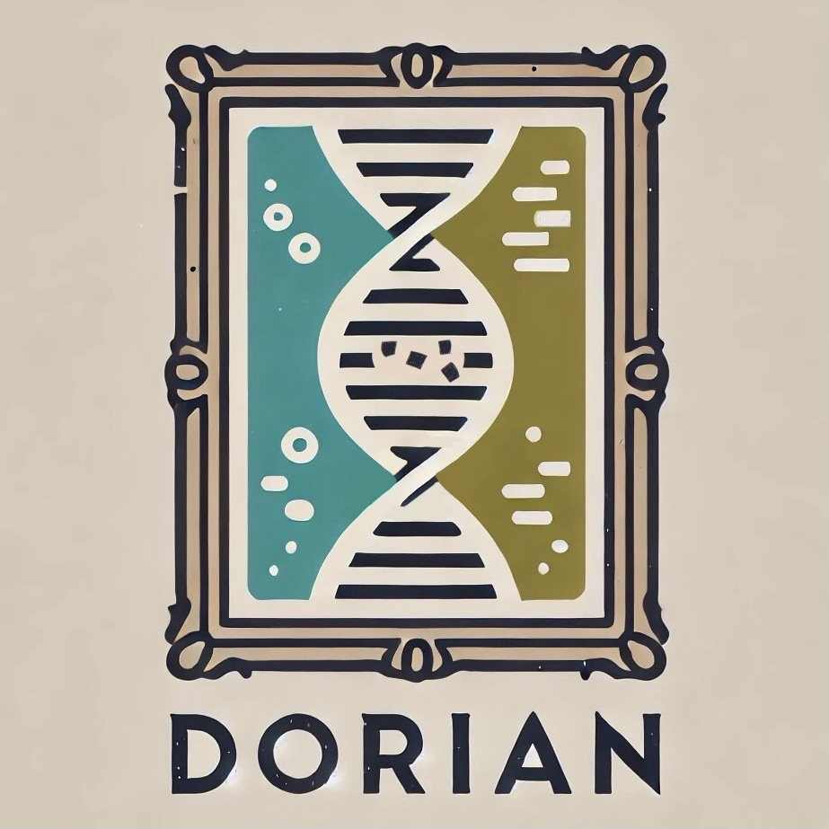

## DORIAN
<table>
    <tr>
        <td>
DORIAN (<b>D</b>amage-aware gen<b>O</b>me <b>R</b>econstruct<b>I</b>on for <b>AN</b>cient data) is a genome reconstruction tool designed for ancient data. DORIAN implements damage-aware genome reconstruction with different methods to detect and correct damaged positions prior to consensus base calling. <br>
DORIAN allows two modes to detect and correct damaged positions, respectively.  
        </td>
        <td>
            
        </td>
    </tr>
</table>

**Damage detection**
* Polarization-Based identifies damaged positions using the reference base.
* Polarization-Free identifies damaged positions using ancient specific damage patterns in the mapping reads.

**Damage correction**
* Silencing replaces damaged positions with a non-informative ('N') base call.
* Weighting performs a weighting on the affected bases to increase or decrease their influence on the base call bases on the severity of the damage observed.
* No correction: Consensus base calls are merely made based on coverage and base frequency
    > ```damage detection``` is not required


## Dependencies
The current version of DORIAN is build with ```JDK 15``` and ```Maven 3.12.1```. A precompiled excutable jar file is in the ```DORIAN/out/artifacts/DORIAN_jar``` folder of the repository.

## Usage
`````
java -jar <path/to/file>DORIAN.jar [options]

 -h,--help                      Print help message

 -b,--bam <FILE>                BAM file of mapped reads
 -r,--reference <FILE>          Reference genome
 -o,--out <PATH>                Path to output directory

 -c,--cov <INT>                 Minimum coverage for consensus calling
 -f,--freq <DOUBLE>             Minimum frequency for consensus calling

--correction <STRING>           Damage correction mode: 
                                    s  (Silencing)
                                    w  (Weighting)
                                    nc (no correction)
--detection <STRING>            Damage detection mode (only for correction modes s and w):
                                    pb (Polarization-Based)
                                    pf (Polarization-Free)  

 Only for correction mode w:                               
 --dp3 <FILE>                   Path to DamageProfile of 3' end
 --dp5 <FILE>                   Path to DamageProfile of 5' end
 
 Optional:
 --bed                          Writes a BED file to --out (ROI table in IGV format for corrected positions)
 --vcf                          Writes a VCF file to --out
`````

## Output Files
<details>
<summary>Log</summary>
The log file contains a listing of the specified cli parameters for the given run. In addition, it lists all positions that were considered for correction (in <code>no correction</code> mode, all positions are listed) and some general information on the position.

* <code>CHROM</code>: The name of the reference sequence
* <code>POS</code>: The position in the reference sequence
* <code>REF</code>: The reference base at <code>POS</code>
* <code>COV</code>: The read coverage observed at <code>POS</code> prior correction
* <code>ALLELE_COUNTS_PRIOR</code>: Counts of observed bases prior correction
* <code>ALLELE_COUNTS_CORRECTED</code>: Counts of corrected bases (excluding N's)
* <code>BASE_CALL</code>: Final base call for the position as included in the Fasta
* <code>BASE_FREQ</code>: Frequency with which the <code>BASE_CALL</code> was made (always <code>-1.0</code> for N's, as a N is only called if the coverage or frequency for another base call is too low)
</details>


<details>
<summary>Fasta</summary>
Reconstructed sequence of the input sample. As header, the sample name as specified in the BAM file name and the chosen correction mode are used
</details>


<details>
<summary>BED</summary>

> Only for runs where ```--correction```is either ```w```  or ```s```.

File that can be loaded to IGV ([Interactive Genome Viewer](https://igv.org)) together with the BAM and reference file to closer inspect the corrected positions. This highlights the positions on which a correction was performed as well as the two previous and following positions.

</details>


<details>
<summary>VCF</summary>
File similar to VCF files generated in GATK's UnifiedGenotyper or HalotypeCaller. 

If ```--correction``` is ```w```, weights which are not a whole number are rounded to the next integer in the AD tag of the VCF file.
</details>